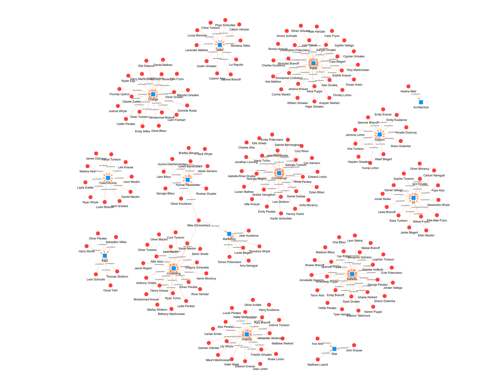

# kgontologies

## Context

[Knowledge Graphs](docs/knowledge_graphs.md) provide a functionally rich framework for working with, presenting and sharing information. In particular the W3C implementation recommendations for knowledge graphs unlock capabilities supported by a wide range of (often) open-source tooling solutions. These include advanced modelling, documentation, query, analysis, inference and data-quality tools for little or no cost.

The learning curve however is reasonably steep - this package seeks to address that with documentation and tooling to help support the development and creation of W3C compliant knowledge-graphs, providing tools to support [serialisation](docs/serialisation.md), [mastering](docs/kg_mastering.md) and [visualisation](docs/kg_visualisation.md).

## Outline

kgontologies is a suite of tools that assist in processing and exploration of data for knowledge graphs.

The tools cover a number of broad capabilities:

### Serialisation and Loading

Marking-up and converting data into RDF can be a difficult process, *kgontologies* sets out a framework to assist with this process and to help achieve results in a shorter amount of time.

### Entity Resolution and Mastering

One benefit of working with knowledge graphs is the potential ease of integration between different data sets, but this can depend on careful entity resolution. *kgontologies* defines a method for assisting with entity mastery through adoption of *fully qualified names* within a namespace-framework.

### Core Ontologies

To provide consistency, a number of ontologies are published as part of this package which seek to underline and support some of the wider functionality. These include:

* NamedObjects Ontology - [kgnaming.owl](ontologies/kgnaming.owl)
* DMCAR Modelling Ontology - [kgdmcar.owl](ontologies/kgdmcar.owl)

### Visualisation Tools

Exploring a knowledge graph can be performed in many ways, *kgontologies* sets out some common, re-usable visualisation options to quickly turn a dataset into something that can be interacted with visually.

### Validation

*kgontologies* framework is SHACL friendly, enabling powerful data quality validation using established W3C standards.

### Inference and OWL Ready

*kgontologies* framework enables OWL-based inference engines to interpret knowledge graph contents to provide insight and inference capabilities.

## Installation

Unzip the code to a preferred location, then run

`pipenv install`

to setup a virtual python environment with dependencies listed in `Pipfile`. Note the specified version of python currently is `3.10` but at time of writing should be considered as `3.10 or greater` with no known breaking changes in later python versions. Consider editing the Pipfile if issues arise on installation.

Pipenv will establish a virtual environment called `kgontologies` (or similar see note later) which can be launched from the command line with:

`pipenv shell` or similar (see your pipenv documentation for alternate options)

This will result in a new shell environment being opened within your terminal window, the name of which will be shown in (brackets) at the prompt, looking something like:

`(kgontologies):$`

> [!NOTE]  
> N.B. Take note of the name of the new environment shown here in brackets as it may slightly deviate from this document. In later commands, you may need to adjust accordingly.

Once your environment is up and running, a quick setup step to register the environment in jupyter might be necessary/useful, this can be done by running the command:

`python -m ipykernel install --user --name=kgontologies`

This will enable jupyter to attach to the specified virtual environment.

## Running

Run jupyter notebook after launching the virtual environment, either by the command

`jupyter notebook`

or sometimes

`python -m jupyter notebook`

Then navigate to and open the `examples` folder to find some examples of using kgontologies to explore.
