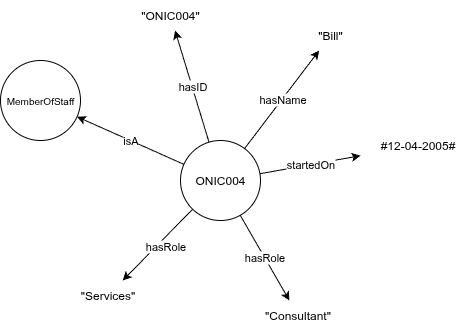
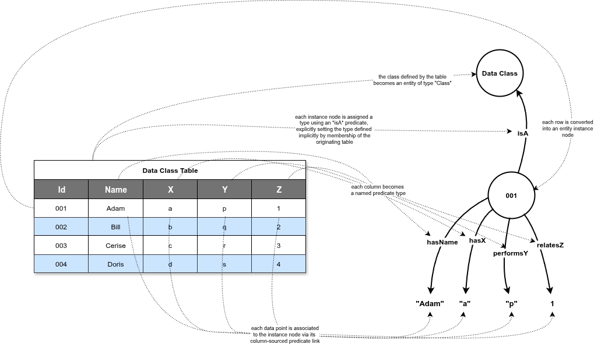

# An introduction to Knowledge Graphs

## What is a knowledge graph?

A knowledge graph is a network of connected concepts used to model knowledge about a topic or domain.

Information is transformed into a structured network of interconnected facts, enabling better understanding, discovery and analysis of relationships.

Knowledge graphs can be defined as $G = \{E,R,F\}$, where $E$ is a collection of Entities, concepts, objects, things or events - $R$ is the set of all possible Relations that can occur between the entities, and $F$ is the set of facts that records how the Entities are Related to one another.

A fact $F$ is defined as $F=\{h,r,t\}$ where $h \in E$ is an entity at the head of the relationship, $t \in E$ is the entity at the tail of the relationship and $r \in R$ is the specific directional relationship that links the two entities together.

These facts are sometimes known as *triples* and can also be denoted using the *SPO* notation $T = (s,p,o)$ where $T$ is a triple (or Fact), $s \in E$ is the *Subject*, $p \in R$ is the *Predicate*, and $o \in E$ is the *Object* of the triple.

A fact in this format encodes the most atomic unit of knowledge possible, and with it, we can express a wide range of relationships in a clear and terse form.

e.g.
>The cat sat on the mat.

Becomes: `T = (TheCat, SatOn, TheMat)`

Where *TheCat* is the subject of the triple, *TheMat* is the object, and they are connected by the directional *SatOn* relationship.

## Comparison to a Relational Model

In a relational (tabular) database, knowledge is encoded in rows and columns, where connected facts or properties for similarly classified objects are defined as columns which are collected together in class-specific table definitions, as data is added, rows of these tables will contain information for each instance of a given class.

Take the example of a database table containing details of *Members of Staff*. The table is defined in terms of its columns, so there might be columns for StaffID, Name, Start-Date, Role and Department for example.

| StaffID | Name   | Start-Date | Role            | Department |
|---------|--------|------------|-----------------|------------|
| ONIC004 | Bill   | 12-04-2005 | Consultant      | Services   |
| ONIC007 | Mishka | 01-08-2009 | Accountant      | Finance    |
| ONIC012 | Sally  | 12-03-2011 | Account Manager | Sales      |

Each row describes a single *Member of Staff* in terms of the relations and properties they have.

A common/useful way of representing these new facts is visually in a *graph*. The entities we reference become the nodes, and the predicates become labelled edges that link between them. Taking the data for a single entity, we can generate the following diagram for a single member of staff.

Behind the scenes, the tabular data we started with has been melted down to a series of facts, described in minimal SPO-form.
The two datasets are equivalent, but the second one is in knowledge-graph compliant SPO format.

| Subject  | Predicate | Object        |
|----------|-----------|---------------|
| ONIC004  | isA       | MemberOfStaff |
| ONIC007  | isA       | MemberOfStaff |
| ONIC012  | isA       | MemberOfStaff |
| ONIC004  | hasID     | ONIC004       |
| ONIC007  | hasID     | ONIC007       |
| ONIC012  | hasID     | ONIC012       |
| ONIC004  | hasName   | Bill          |
| ONIC007  | hasName   | Mishka        |
| ONIC012  | hasName   | Sally         |
| ONIC004  | startedOn | 12-04-2005    |
| ONIC007  | startedOn | 01-08-2009    |
| ONIC012  | startedOn | 12-03-2011    |
| ONIC004  | hasRole   | Consultant    |
| ONIC007  | hasRole   | Accountant    |
| ONIC012  | hasRole   | Account Manager    |
| ONIC004  | worksIn   | Services      |
| ONIC007  | worksIn   | Finance       |
| ONIC012  | worksIn   | Sales         |

At first glance, this might raise an eyebrow, we've just gone from a simple table with only 3 rows and 5 columns to a new table with 18 rows and 3 columns holding the exact same information. What's the point?

> [!NOTE]
> Note how the class-information implicit in the row's inclusion in a specific table (i.e. MemberOfStaff) becomes explicitly stated through the *isA* predicates at the top.

Whilst we've increased the number of rows we have to deal with, the advantage gained is that we've established a singular generic structure, (Subject, Predicate, Object), into which we can map *any* data from *any* source.

This is extremely useful when attempting to integrate data from multiple sources.

The general mapping from tabular to triple format often follows a pattern outlined below:

Data covering domains of interest will tend to be isolated in their own siloed datastores in which data will be partitioned by class into their respective tables, each holding details for a specific class of entity.

The staff table we looked at earlier held details about each member of staff, but we might find a Department table that holds details about each department.

| Department    | CostCentre | Budget     |
|---------------|------------|------------|
| Services      | 01245      | 123,670    |
| Finance       | 01455      |  45,455    |
| Sales         | 02637      | 456,599    |

We can apply the same transformation to this table to convert it into a full set of SPO triples.

| Subject  | Predicate     | Object        |
|----------|---------------|---------------|
| Services | isA           | Department    |
| Finance  | isA           | Department    |
| Sales    | isA           | Department    |
| Services | hasName       | Services      |
| Finance  | hasName       | Finance       |
| Sales    | hasName       | Sales         |
| Services | hasCostCentre | 01245         |
| Finance  | hasCostCentre | 01455         |
| Sales    | hasCostCentre | 02637         |
| Services | hasBudget     | 123,670       |
| Finance  | hasBudget     |  45,455       |
| Sales    | hasBudget     | 456,599       |

Since these triples also follow the same singular SPO convention as before, they can be added to the set of triples that referenced the Staff, together forming a larger unified store containing knowledge of Staff and the Departments they work in.

As more data is integrated into the graph, the knowledge captured becomes richer and more complete. Previous barriers to integration, like differing schemas and isolated datastores are overcome and the valuable information they hold becomes available to all.

