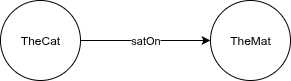
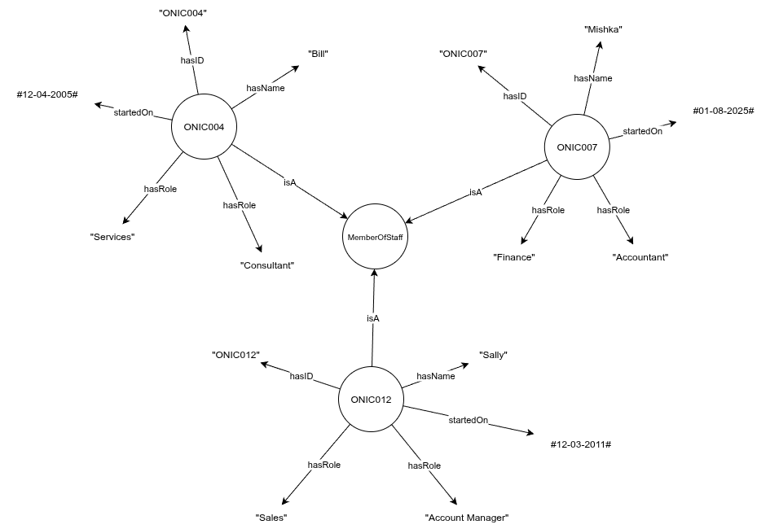
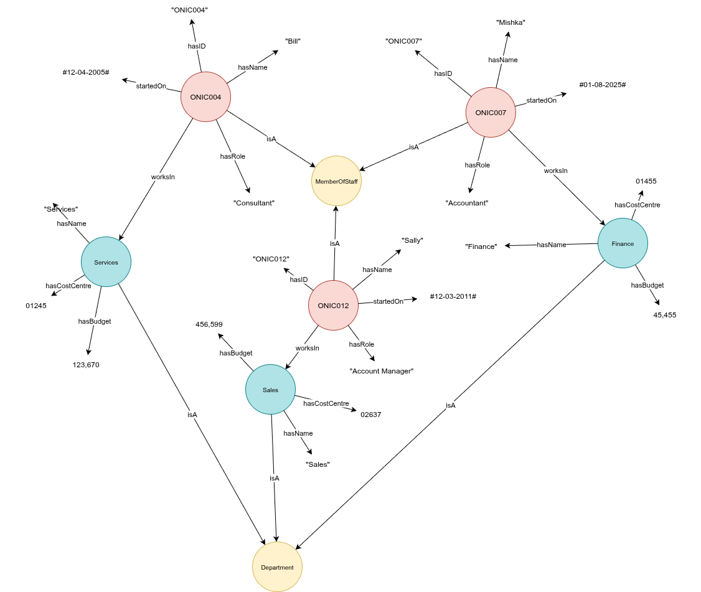

# An introduction to Knowledge Graphs

## What is a knowledge graph?

A knowledge graph is a network of connected concepts used to model knowledge about a topic or domain.

Information is transformed into a structured network of interconnected facts, enabling better understanding, discovery and analysis of relationships.

Knowledge graphs can be defined as $G = \lbrace E,R,F \rbrace$, where $E$ is a collection of Entities, (concepts, objects, things or events) - $R$ is the set of all possible Relations that can occur between the entities, and $F$ is the set of facts that records how the Entities are Related to one another.

A fact $F$ is defined as $F=\lbrace h,r,t \rbrace$ where $h \in E$ is an entity at the head of the relationship, $t \in E$ is the entity at the tail of the relationship and $r \in R$ is the specific directional relationship that links the two entities together.

These facts are sometimes known as *triples* and can also be denoted using the *SPO* notation $T = (s,p,o)$ where $T$ is a triple (or Fact), $s \in E$ is the *Subject*, $p \in R$ is the *Predicate*, and $o \in E$ is the *Object* of the triple.

A fact in this format encodes the most atomic unit of knowledge possible, and with it, we can express a wide range of relationships in a clear and terse form.

e.g.
>The cat sat on the mat.

Becomes: `T = (TheCat, satOn, TheMat)`

Where *TheCat* is the subject of the triple, *TheMat* is the object, and they are connected by the directional *satOn* relationship.

Any fact or atom of knowledge can be represented in this way, and a collection of such facts can be considered a *knowledge graph*.

## Comparison to the traditional Relational Model

In a relational (tabular) database, knowledge is encoded in rows and columns, where connected facts or properties for similarly classified objects are defined as columns which are collected together in class-specific table definitions, as data is added, rows of these tables will contain information for each instance of a given class.

Take the example of a database table containing details of *Members of Staff*. The table is defined in terms of its columns, so there might be columns for StaffID, Name, Start-Date, Role and Department for example.

| StaffID | Name   | Start-Date | Role            | Department |
|---------|--------|------------|-----------------|------------|
| ONIC004 | Bill   | 12-04-2005 | Consultant      | Services   |
| ONIC007 | Mishka | 01-08-2009 | Accountant      | Finance    |
| ONIC012 | Sally  | 12-03-2011 | Account Manager | Sales      |

Each row describes a single *Member of Staff* in terms of the relations and properties defined by the table definition.

We can transform this information into the atomic facts they represent. Lets do this for the first row of data in the above table.

A common/useful way of representing these new facts is visually in a *graph*. The entities we reference become the nodes, and the predicates become labelled edges that link between them. 

Lets continue the process and convert the entire table into a knowledge graph:

Behind the scenes, the tabular data we started with has been melted down to a series of facts, described in minimal SPO-form.
The two datasets are equivalent, but the second one is in knowledge-graph compliant SPO format.

| Subject  | Predicate | Object        |
|----------|-----------|---------------|
| ONIC004  | isA       | MemberOfStaff |
| ONIC007  | isA       | MemberOfStaff |
| ONIC012  | isA       | MemberOfStaff |
| ONIC004  | hasID     | ONIC004       |
| ONIC007  | hasID     | ONIC007       |
| ONIC012  | hasID     | ONIC012       |
| ONIC004  | hasName   | Bill          |
| ONIC007  | hasName   | Mishka        |
| ONIC012  | hasName   | Sally         |
| ONIC004  | startedOn | 12-04-2005    |
| ONIC007  | startedOn | 01-08-2009    |
| ONIC012  | startedOn | 12-03-2011    |
| ONIC004  | hasRole   | Consultant    |
| ONIC007  | hasRole   | Accountant    |
| ONIC012  | hasRole   | Account Manager    |
| ONIC004  | worksIn   | Services      |
| ONIC007  | worksIn   | Finance       |
| ONIC012  | worksIn   | Sales         |

At first glance, this might raise an eyebrow, we've just gone from a simple table with only 3 rows and 5 columns to a new table with 18 rows and 3 columns holding the exact same information. What's the point?

> [!NOTE]
> Note how the class-information implicit in the row's inclusion in a specific table (i.e. MemberOfStaff) becomes explicitly stated through the *isA* predicates at the top.

Whilst we've increased the number of rows we have to deal with, the advantage gained is that we've established a singular generic structure, (Subject, Predicate, Object), into which we can map *any* data from *any* source.

This is extremely useful when integrating data from multiple sources.

Data covering domains of interest will tend to be isolated in their own siloed datastores in which data will be partitioned by class into their respective tables, each holding details for a specific class of entity.

The staff table we looked at earlier held details about each member of staff, but we might find a Department table that holds details about each department.

| Department    | CostCentre | Budget     |
|---------------|------------|------------|
| Services      | 01245      | 123,670    |
| Finance       | 01455      |  45,455    |
| Sales         | 02637      | 456,599    |

We can apply the same transformation to this table to convert it into a full set of SPO triples.

| Subject  | Predicate     | Object        |
|----------|---------------|---------------|
| Services | isA           | Department    |
| Finance  | isA           | Department    |
| Sales    | isA           | Department    |
| Services | hasName       | Services      |
| Finance  | hasName       | Finance       |
| Sales    | hasName       | Sales         |
| Services | hasCostCentre | 01245         |
| Finance  | hasCostCentre | 01455         |
| Sales    | hasCostCentre | 02637         |
| Services | hasBudget     | 123,670       |
| Finance  | hasBudget     |  45,455       |
| Sales    | hasBudget     | 456,599       |

Since these triples also follow the same singular SPO convention as before, they can be added to the set of triples that referenced the Staff, together forming a larger unified store containing knowledge of Staff and the Departments they work in.

As more data is integrated into the graph, the knowledge captured becomes richer and more complete. Previous barriers to integration, like differing schemas and isolated datastores are overcome and the valuable information they hold becomes available to all.

## Applications

Knowledge graphs built in this way can be put to multiple uses. 

### Knowledge Sharing

Complex domains can be difficult to become attuned to, so for new starters on a project, team or organisation, it can be useful to be able to explore the information and knowledge that describes the domain or activity they will be participating in.

Often this data will already be available in the organisation, but often will be siloed into functionally-separate tools or applications. These might include:

* HR System - holding names and ids of staff, with perhaps line-manager information, role and departmental information.

* CRM System - holding details of customers, suppliers and other 3rd party contacts with perhaps some history of dealings with each party.

* Projects System - containing details of individual projects, either internally or externally, with details of who worked on them, project cost, duration and outcomes. 

* Application Repository - listing systems and applications that are active within the organisation, perhaps including owners, maintenance costs

* Domain Knowledge - any (often unstructured) documentation covering the concepts and workings of the domain covered, jargon used and processes followed as part of running the business

And so on, normally the information located in each of these systems is proprietary and can be difficult to access - often requiring access to multiple systems and having to learn how to operate each of them. For very large organisations, there may be multiple instances of each of the above, to cater for differing lines of business or other organisational partitioning reasons.

Extracting the core data from each system and populating a holistic knowledge graph can help link up the data spread across multiple systems and silos, and make it available in a single place for analysis and query. Additionally, because the W3C implementation recommendations support federated knowledge sharing, this task can be distributed out to the teams responsible for each data set to enable rapid adoption and benefit resolution.